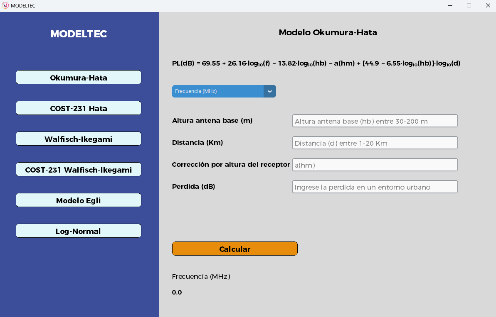

# 📡 Simulador de Modelos de Propagación de Ondas

Este proyecto es una aplicación de escritorio interactiva construida con **Python** y **CustomTkinter**, diseñada para calcular y visualizar pérdidas por propagación de señal usando distintos modelos como:

 ✅ COST-231 Hata  
 ✅ Egli  
 ✅ Walfisch-Ikegami  
 ✅ COST-231 Walfisch-Ikegami  
 ✅ Log-Normal

---

## 🎯 Objetivo

Ofrecer una herramienta educativa y funcional para estudiantes y profesionales en el área de **telecomunicaciones**, que les permita analizar de forma visual y práctica los diferentes modelos de atenuación.

---

## 🖥️ Captura de la Interfaz



---

## ⚙️ Características

- Interfaz moderna con `CustomTkinter`
- Cálculos dinámicos por modelo
- Preparado para extenderse con nuevos modelos

---

## 🧮 Fórmulas Implementadas

```txt
Okumura-Hata:         PL(dB) = 69.55 + 26.16·log₁₀(f) − 13.82·log₁₀(hb) − a(hm) + [44.9 − 6.55·log₁₀(hb)]·log₁₀(d)
COST-231 Hata:        PL(dB) = 46.3 + 33.9·log₁₀(f) − 13.82·log₁₀(hb) + [A(hm)] + (44.9 − 6.55·log₁₀(hb))·log₁₀(d) + C
Egli:                 PL(dB) = 117 + 40·log₁₀(d) − 20·log₁₀(hb·hm) + 20·log₁₀(f)
Walfisch-Ikegami:     PL(dB) = L₀ + Lᵣₜₛ + Lₘₛd
COST-231 Walfisch:    PL(dB) = 42.6 + 26·log₁₀(d) + 20·log₁₀(f)
Log-Normal:           PL(dB) = PL(d₀) + 10·n·log₁₀(d/d₀) + Xσ
